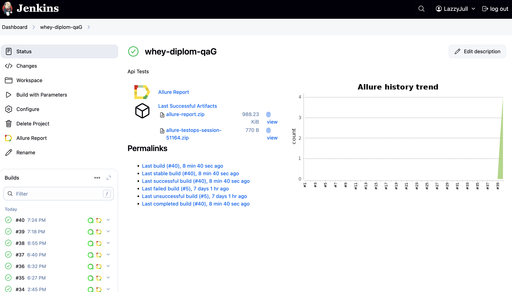
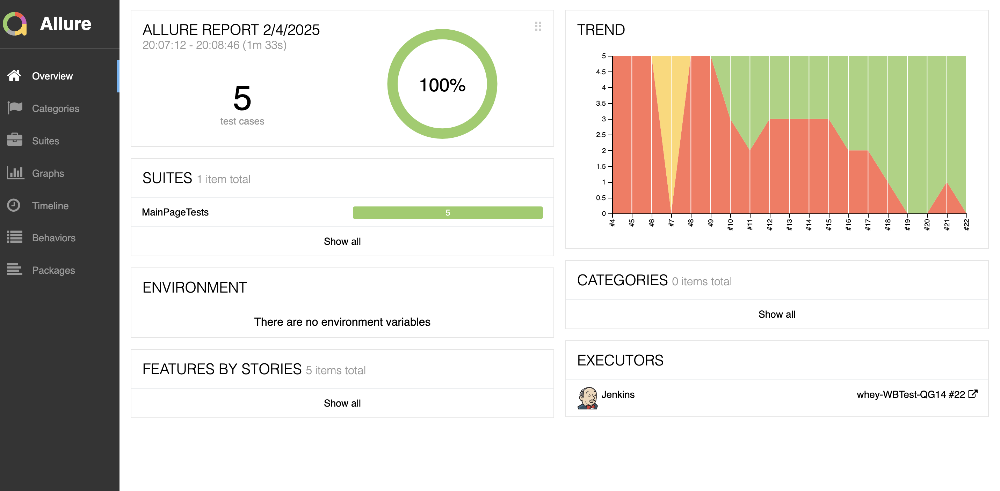
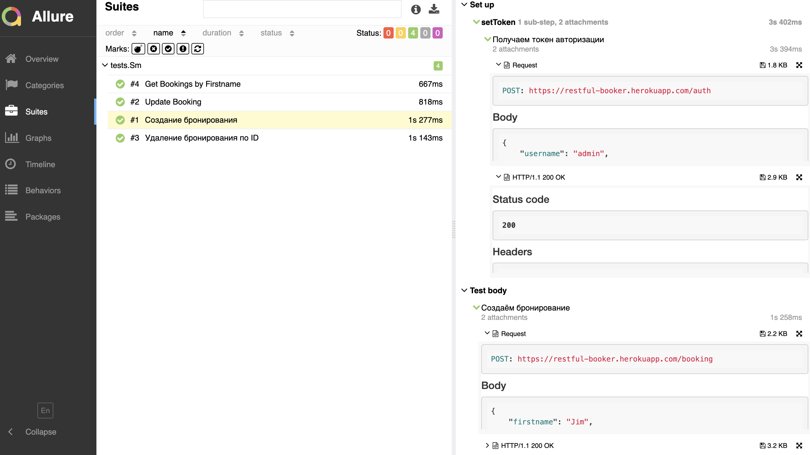
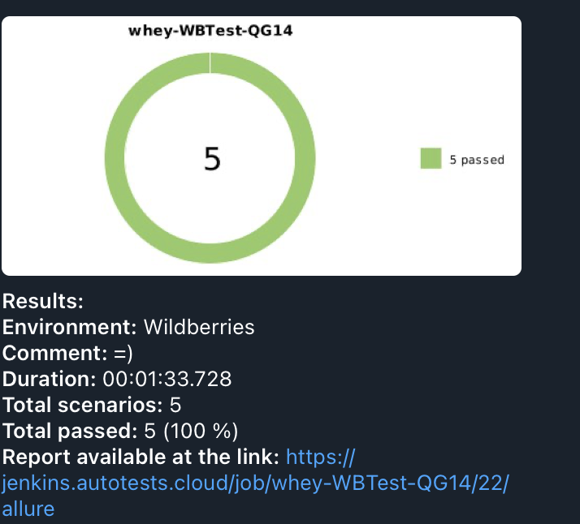

# Проект автоматизации тестирования для [**Restful-Booker**](https://restful-booker.herokuapp.com/)

**Restful-booker** — API, с помощью которого вы можете узнать больше о тестировании API или опробовать инструменты для тестирования API.

---
## *Содержание*:

- [Технологии и инструменты](#tools)
- [Примеры автоматизированных тест-кейсов](#cases)
- [Сборка в Jenkins](#jenkins)
- [Запуск из терминала](#console)
- [Allure отчет](#allure)
- [Уведомление в Telegram](#telegram)

---
<a id="tools"></a>
## **🛠️ Технологии и инструменты**

<p align="center">  
<a href="https://www.jetbrains.com/idea/"></a>  
<a href="https://www.java.com/"></a>  
<a href="https://github.com/"></a>  
<a href="https://junit.org/junit5/"></a>  
<a href="https://gradle.org/"></a>  
<a href="https://selenide.org/"></a>  
<a href="https://aerokube.com/selenoid/"></a>  
<a href="https://github.com/allure-framework/allure2"></a>  
<a href="https://www.jenkins.io/"></a>  
</p>

---
<a id="cases"></a>
## **✅ Примеры автоматизированных тест-кейсов**

- ✓ *Логин и генерация токена авторизации для последующего использования в тестах*
- ✓ *Создание нового бронирования*
- ✓ *Поиск бронирования по имени*
- ✓ *Изменение бронирования*
- ✓ *Удаление бронирования*
- ✓ *Частичное обновление бронирования по ID*

---
<a id="jenkins"></a>
## **🚀 Сборка в Jenkins**

### [Jenkins-сборка](https://jenkins.autotests.cloud/job/whey-diplom-qaG/)

<p align="center">  
<a href="https://jenkins.autotests.cloud/job/whey-diplom-qaG/"></a>  
</p>

### **Параметры сборки в Jenkins:**

- `browser` (браузер, по умолчанию Chrome)
- `browserVersion` (версия браузера, по умолчанию 127)
- `browserSize` (размер окна браузера, по умолчанию 1920x1080)
- `remoteUrl` (логин, пароль и адрес удаленного сервера Selenoid)

---
<a id="console"></a>
## **🖥️ Команды для запуска из терминала**

### **Локальный запуск:**
```bash  
gradle clean AllTests
```

### **Удалённый запуск через Jenkins:**
```bash  
gradle clean AllTests 

```

---
<a id="allure"></a>
## **📊 [Allure отчет](https://jenkins.autotests.cloud/job/whey-diplom-qaG/40/allure/)**


<p align="center">  
<a href="https://jenkins.autotests.cloud/job/whey-diplom-qaG/40/allure/"></a>  
</p>

---
### **Тест кейсы**
<p align="center">  
<a href="https://jenkins.autotests.cloud/job/whey-diplom-qaG/40/allure/"></a>  
</p>

---
<a id="telegram"></a>
## **📩 Уведомление в Telegram при помощи бота**
---
<p align="center">  
  
</p>

Автоматическое уведомление о результатах тестов отправляется в Telegram через бота.

---

